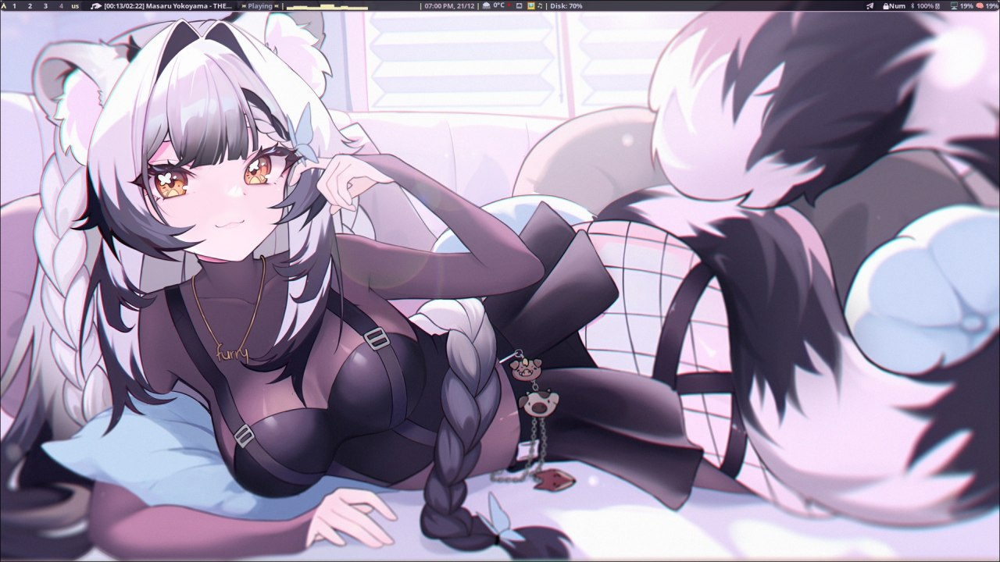

# hyprland

It's better to hang yourself than make a config for hyprland

## Installation
#### step 1
~~~bash
sudo pacman -S fuzzel waybar swaync swww nautilus kitty fish bc cava ttf-firacode-nerd noto-fonts ttf-jetbrains-mono-nerd ttf-font-awesome noto-fonts-emoji python-pywal
~~~
#### step 2
~~~bash
git clone https://github.com/NyxAiko7/config-hypr.git
cd config-hypr
~~~
### step 2.5

~~~bash
wal -i Let's go to the wallpaper
~~~

#### step 3
~~~bash
sudo cp -r colors-fuzzel.ini  ~/.config/wal/templates/
sudo cp -r hypr ~/.config
sudo cp -r waybar ~/.config
sudo cp -r kitty ~/.config
sudo cp -r swaync ~/.config
sudo cp -r fuzzel ~/.config
~~~

## Warning
don't forget to set your screen resolution

