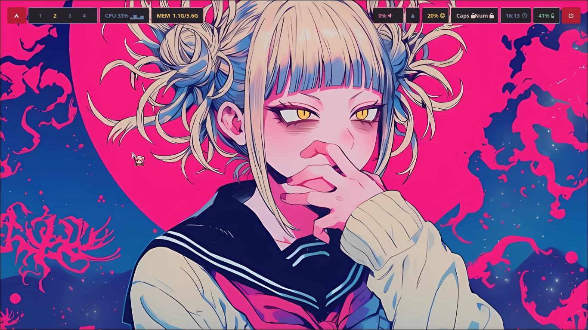

# hyprland

It's better to hang yourself than make a config for hyprland

## Installation
#### step 1
~~~bash
sudo pacman -S wofi waybar dunst hyprpaper dolphin kitty fish  
~~~
#### step 2
~~~bash
git clone https://github.com/NyxAiko7/config-hypr.git
cd config-hypr
~~~
#### step 3
~~~bash
cp -r hypr ~/.config
cp -r waybar ~/.config
cp -r kitty ~/.config
cp -r dunst ~/.config
~~~

## Warning
don't forget to set your screen resolution

